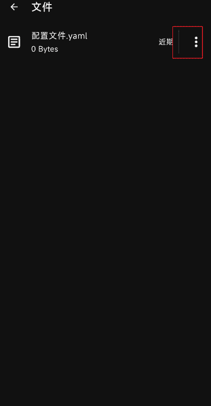
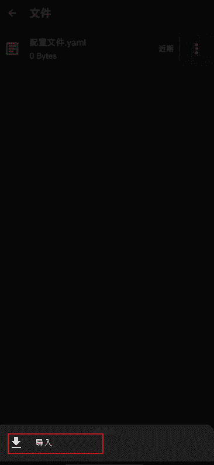
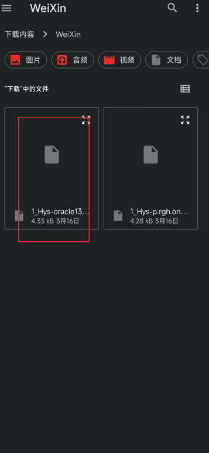
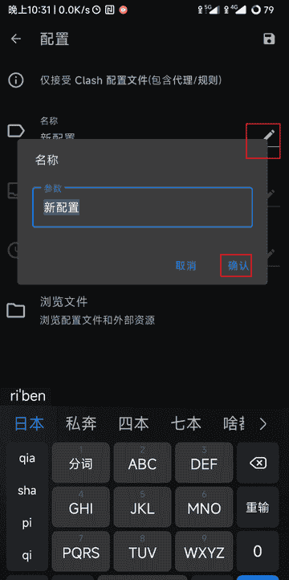
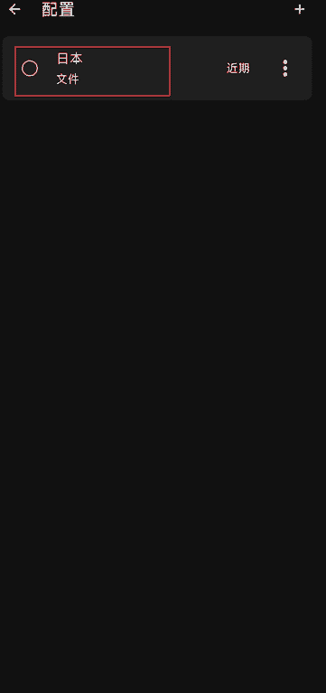

## 下载ClashMetaForAndroid并安装

F-Droid
[https://f-droid.org/packages/com.github.metacubex.clash.meta/](https://f-droid.org/packages/com.github.metacubex.clash.meta/)
Github
[https://github.com/MetaCubeX/ClashMetaForAndroid/releases](https://github.com/MetaCubeX/ClashMetaForAndroid/releases)

## 配置文件导入
- 点击配置

- 点击从文件导入

- 点击浏览文件

- 点击选择文件

- 点击下方导入按钮

- 选择配置文件

- 更改配置名称

- 点击保存

- 此时app会根据配置文件中的规则地址去下载分流规则，视网络情况，第一次导入可能会比较慢

- 加载完成配置文件后，点击选中需要的代理

- 点击启动代理，系统提示需要建立vpn连接，点击确定

此时就能打开网页浏览谷歌等网站了，配置完成后如果不能访问，先不要关闭代理，稍等一两分钟再开网页试下