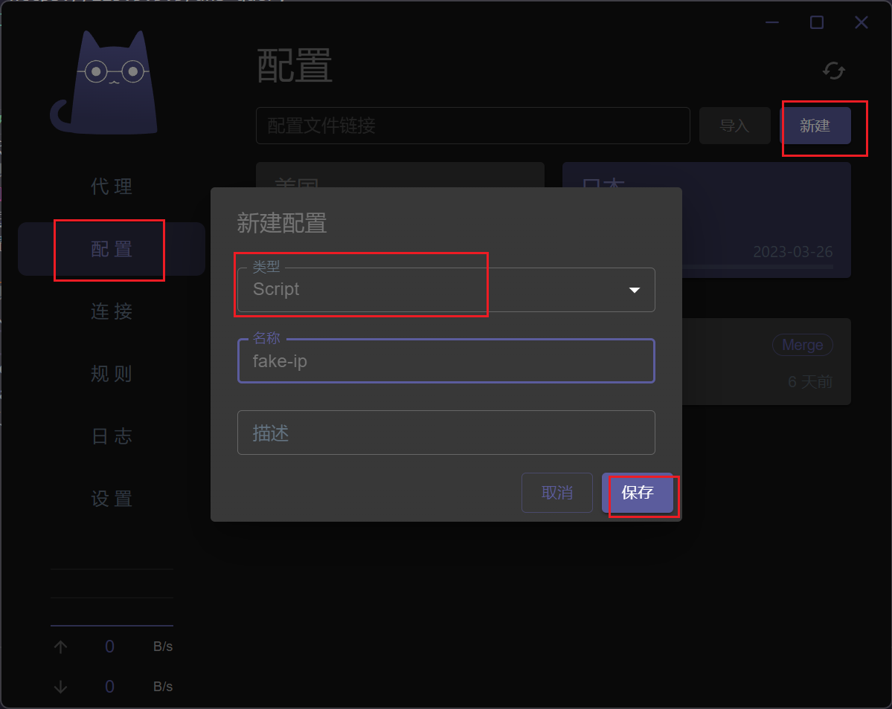
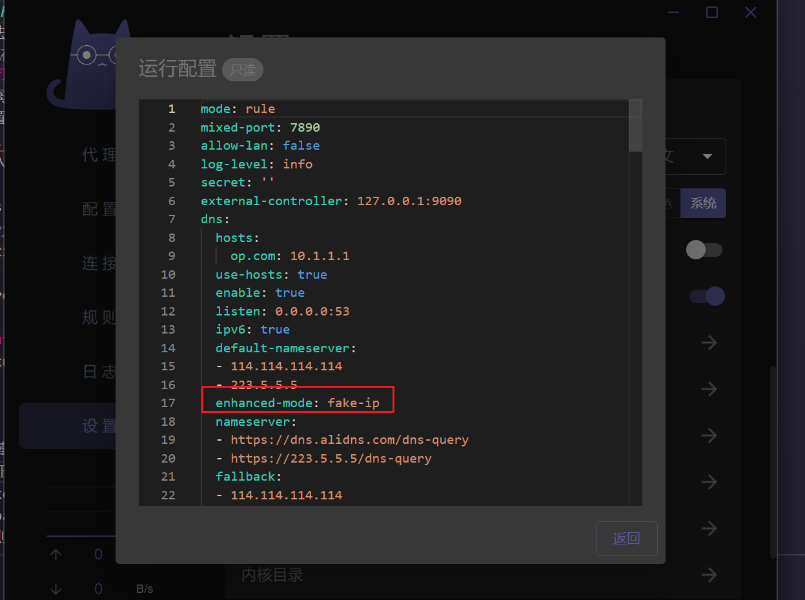
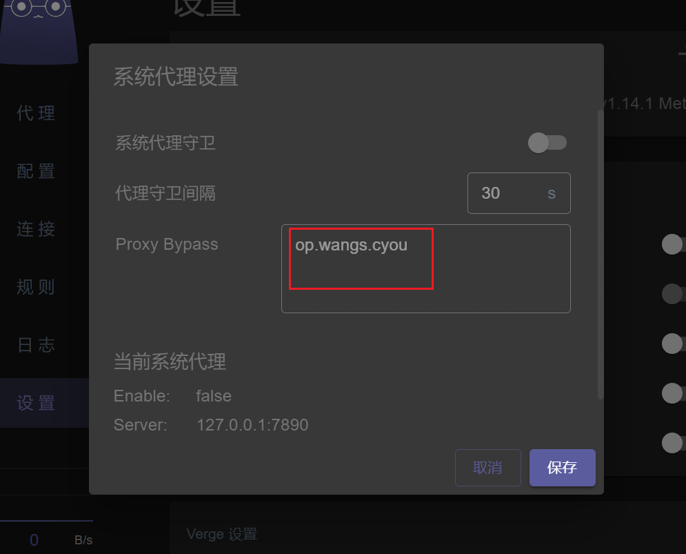
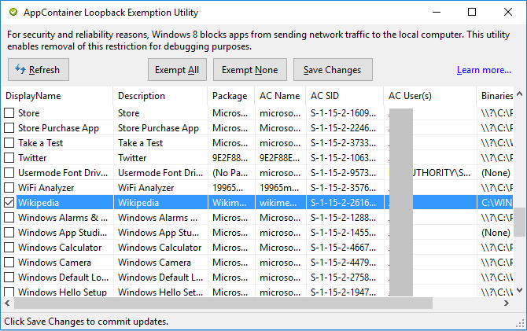
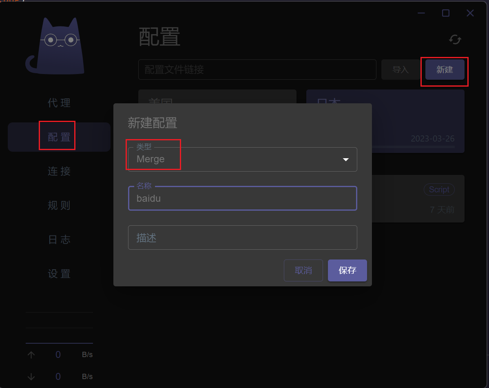

## 安全dns

在国内如果使用chrome、edge，最好在设置中搜索dns，然后把默认开启的安全dns选项关掉，国内体验不好，容易造成访问慢等问题
## 访问网站偶尔会报错
其他网站没有问题，大部分时候为证书报错，点击查看证书会发现，证书跟网站不一致，一般是因为国内的dns污染，过段时间就恢复正常了。
也可以通过设置clash的dns模式为fake-ip来减少dns污染的几率
两种方式：
### 通用方式
  - 编辑配置文件，clash-verge中是右键点击配置文件->编辑文件，找到以下部分
```yaml
dns:
  hosts:
    'op.com': 10.1.1.1
  use-hosts: true
  enable: true
  listen: 0.0.0.0:53
  ipv6: true
  default-nameserver:
    - 114.114.114.114
    - 223.5.5.5
  enhanced-mode: redir-host
  nameserver:
    - https://dns.alidns.com/dns-query
    - https://223.5.5.5/dns-query
  fallback:
    - 114.114.114.114
    - 223.5.5.5
```
将`enhanced-mode: redir-host`改为`enhanced-mode: fake-ip`，注意冒号后面的空格
此方法只影响当前配置文件
### 打补丁方式
    每个clash客户端都提供类似的打补丁的方式，对于clash-verge，可以用以下操作：
- 配置->新建->类型选择Script

- 输入以下代码，并保存
  
```js
// Define the `main` function
function main(config) {
  if(!config.dns){
    return config
  }
  config.dns['enhanced-mode']='fake-ip'
  return config;
}

```
- 右键新建的配置文件->启用，点击右上角刷新按钮重载配置
- 验证是否生效：设置->运行配置，查看实际运行的配置文件已经被修改


> 此种方法是通过js来修改配置文件，在加载主配置文件时会先用此脚本来预处理，所以可以应用于所有的配置文件，其他clash客户端（如openclash、clash for windows等都有类似的补丁方式
> fake-ip可以有效的避免dns污染，但是也有缺点，就是你关闭clash的时候可能会由于系统/浏览器dns缓存问题，导致暂时不能浏览网页，此时需要手动刷新dns缓存，或者保持clash客户端长期开启，想体验稳定的网络，推荐长期开启clash并使用fake-ip模式
> 参考：https://blog.skk.moe/post/what-happend-to-dns-in-proxy/

## 本机hosts不生效
clash开启了dns后，本机配置的hosts默认不生效，虽然clash配置中给出了内置hosts或者使用系统hosts的配置项，但我测试后都没有生效，不知道是不是使用方式不对，查官方文档没有详细说明
### 解决方案
对于clash-verge，点击设置->系统代理后的齿轮，将自己需要使用本机hosts的域名填入即可



## windows应用商店不能访问

开启系统代理后，windows应用商店不能访问，是因为uwp的应用程序都默认不允许本地回环代理（127.0.0.1），需要使用工具来解锁此限制
工具：https://telerik-fiddler.s3.amazonaws.com/fiddler/addons/enableloopbackutility.exe
选中所有（如果不想解锁全部uwp，那就只选应用商店），点击“save changes”



## 自定义规则
想指定某个域名走代理或者直连，一是可以修改配置文件中的rules，但是不能全局生效，而且你如果购买的机场，那配置文件在订阅更新后会被覆盖，可以使用脚本或者打补丁的方式来设置通用规则
以下简单说下clash-verge上使用打补丁的方式来添加规则：
### 创建一个规则，强制让ip138走代理
> 存疑：此方式设置baidu后检测ip未改变，但是方法应该没问题，可能是规则匹配的过程没完全理解
- 打开ip138，会看到ip地址为国内
- 配置->新建->类型选择Merge



- 修改为以下代码

```yaml
# Merge Template for clash verge
# The `Merge` format used to enhance profile

prepend-rules:
    # 在现有规则前追加规则
    # 默认内置通道  DIRECT直连 REJECT拒绝 ，PROXY对应配置文件中的代理组，在我给出的配置文件中，都为PROXY
    # 表示 域名后缀 为 ip138.com时 走 PROXY通道
    - DOMAIN-SUFFIX,ip138.com,PROXY # yaml格式，注意缩进
prepend-proxies:

prepend-proxy-groups:

append-rules:
# 在现有规则后追加规则
append-proxies:

append-proxy-groups:

```

- 右键启用，点击右上角刷新按钮
- 此时打开ip138.com，会发现地址显示的为代理地址
- 排查问题可以通过查看“运行配置”是否与预期相同，以及访问网址后，查看日志，看看命中了哪条规则
- 详细支持的规则配置，见引用链接

> Merge和Script具体的事项，参考 https://github.com/zzzgydi/clash-verge/wiki/%E4%BD%BF%E7%94%A8%E6%8C%87%E5%8D%97
> clash详细支持的规则配置类型，参考 https://lancellc.gitbook.io/clash/clash-config-file/rules