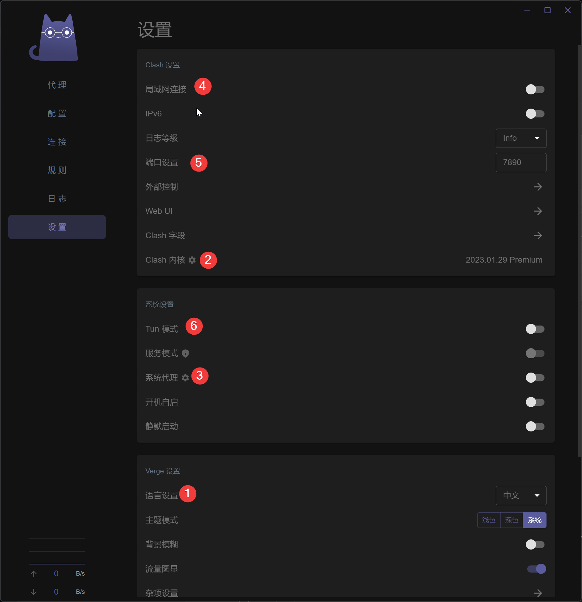
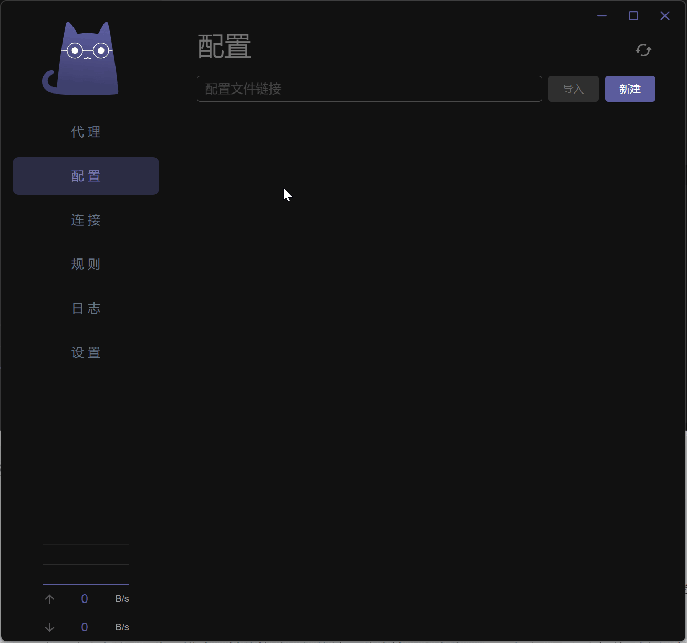
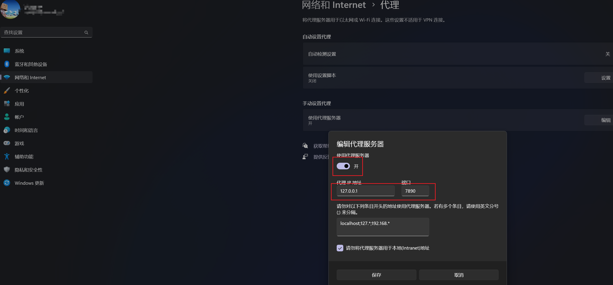

> 由于服务器可能被盯上，尤其在开会的过程中，v2ray、trojan协议端口被封的太过频繁，把协议切换为了hysteria，使用了udp，速度快，且能够动态的改变端口，一定程度能够防封。
> 
> 同时，原v2rayN和v2rayNG客户端对hysteria协议支持不好，配置较复杂，把客户端统一切换到了clash系列，包括路由器使用OpenClash、Windows/Mac使用clash verge(比较clash for windows更简洁)、安卓使用Clash.Meta、苹果待定（需要外区购买app）。

## Windows/Mac/Linux

#### 下载clash-verge,安装或解压

-   https://github.com/zzzgydi/clash-verge/releases

#### 打开Clash Verge.exe(macOS直接从菜单打开Clash Verge)

> ##### 按照上图标注顺序进行设置
> 
> 1.  更改界面语言
> 2.  修改Clash内核为Clash.Meta
> 3.  打开系统代理
> 4.  可选：打开后，其他局域网中的机器可以无需安装第三方软件，直接设置系统代理为本机即可进行科学上网
> 5.  可选：本机代理服务器的端口，有软件或局域网机器需要手动设置代理时端口填写该端口
> 6.  可选：默认走的http代理模式，某些软件，如终端、游戏等不会走代理，开启该项后，会切换到类似虚拟网卡的模式，所有软件都会走Clash分流

#### 导入配置文件

按图导入配置文件，并点击选择需要使用的节点，另外，在代理标签页可以修改全局/规则代理模式

导入配置

### 可能出现的问题

如果配置完了不能使用，可以查看系统网络设置中代理有没有开启，端口正不正确，如果不正确，可以手动修改，或者在Clash中，将系统代理选项关掉再打开

